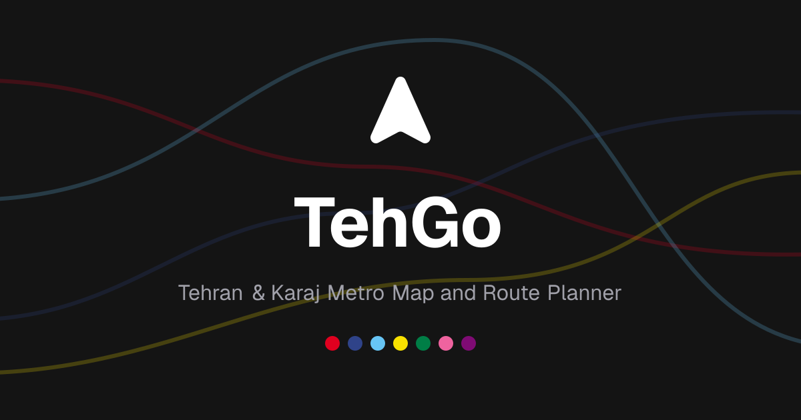

<p align="center">
  <a href="https://tehgo.ir">
    
  </a>
</p>

<h1 align="center">TehGo</h1>

<p align="center">
  Interactive map and route planner for the Tehran &amp; Karaj metro — bilingual, offline-capable, and open source.
</p>

<p align="center">
  <a href="https://github.com/taymakz/tehgo"></a>
  <a href="https://myket.ir/app/ir.tehgo"></a>
  <a href="https://github.com/taymakz/tehgo/blob/main/apps/android/CLAUDE.md"></a>
</p>

<p align="center">
  <a href="https://tehgo.ir">tehgo.ir</a>
  ·
  <a href="https://myket.ir/app/ir.tehgo">Android app (Myket)</a>
  ·
  <a href="https://taymakz.ir">Creator</a>
</p>

<p align="center">
  <a href="https://tehgo.ir"></a>
</p>

## What is TehGo?

**TehGo (تهگو)** is a Tehran + Karaj metro companion, built twice over: a full-map Next.js web app and a native Android app, both reading from the same bundled station/line/graph data. There's no backend — routing is computed on-device with a DFS-based pathfinder that returns both the fastest route and the one with the fewest transfers, plus turn-by-turn boarding and transfer guidance in Persian and English.

- **Full-map web experience** — a floating From/To picker over a live MapLibre map, auto-computed routes, recent routes, and a route-detail image you can export and share.
- **Bilingual, RTL-first** — Persian (default) and English, including correctly shaped Persian text in generated route images.
- **Installable PWA** — works offline, auto-updates in the background, and prompts installation (or points Android users to the native app on Myket instead).
- **Native Android app** — Kotlin + Jetpack Compose, offline map tile caching, and the same route-finding engine.
- **Shareable links** — every route is a URL (`?from=&to=`) you can copy or share directly to the app if it's installed.

## Run locally (web)

```bash
pnpm install
pnpm --filter web dev
```

Open [http://localhost:3000](http://localhost:3000).

For the Android app, see [apps/android/CLAUDE.md](./apps/android/CLAUDE.md) for build and release instructions.

## Checks

Run these before pushing:

```bash
pnpm typecheck
pnpm lint
pnpm build
```

## Project structure

This is a Turborepo monorepo (pnpm workspaces):

| Path | What it is |
| --- | --- |
| `apps/web` | The Next.js 16 web app — the full-map route planner, i18n, PWA, and OG image generation. |
| `apps/android` | The native Android app (Kotlin, Jetpack Compose, MapLibre) — kept in sync with the same station/line/graph data. |
| `packages/metro-core` | Pure domain logic shared across the web app: the DFS route finder, route guides, and static metro data (`graph.json`, `lines.json`, `stations.json`, `paths.json`). |
| `packages/ui` | Shared component library used by `apps/web` (shadcn-style, Base UI primitives, Tailwind v4). |
| `packages/eslint-config`, `packages/typescript-config` | Shared lint/TS config across the workspace. |

## Contributing

PRs and issues are welcome — open one at [github.com/taymakz/tehgo](https://github.com/taymakz/tehgo). For Android-specific changes (versioning, release signing, git workflow), read [apps/android/CLAUDE.md](./apps/android/CLAUDE.md) first.
